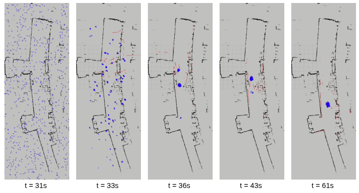
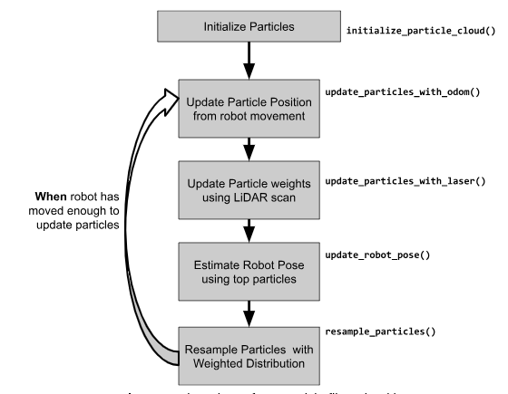
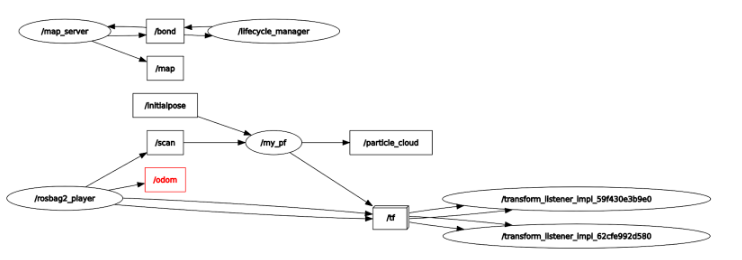

# Creating a Particle Filter in C++

David Barsoum, Dan Khoi Nguyen\
Computational Robotics at Olin College \| Fall 2025

**Figure 1**: From left to right, our particle filter begins and
correctly converges on our robot pose.

# 1 Project Goal

The goal of this project was to implement a working Particle Filter in C++. A Particle Filter is a type of localization algorithm commonly used in robotics when the map of a robot is known, but not the specific location within the map. For instance, given a map of a house, we would like to determine where a Rumba robot is.

A particle filter works by generating many possible guesses of the robot’s location, called particles. Initially, these guesses are spread randomly across the map. As the robot moves and collects LiDAR data–essentially describing what it sees–we compare each particle’s prediction of the environment to the robot’s actual observations. Particles that closely match what the robot sees are considered “good” guesses. Over time, we focus more on these good guesses, creating new particles around them. Gradually, the particles cluster tightly together, indicating that we’ve likely found the robot’s true position. In simple terms, it’s like playing a game of “hot or cold” with the robot, where we put more effort into the guesses that are getting “hotter.”

For our specific implementation, we were given a bag (or recording file) of a robot moving around a known map, which contained LiDAR and odometry data over time, and a map of where our robot was driving around.

# 2 Approach

Our approach began with helper code given from the assignment, where we
had to implement several algorithm steps, including the core of the
algorithm of resampling and updating the particles over time as the
robot moved throughout the map.

The core structure of our Particle Filter is the same throughout others;
we sample particles, use data (LiDAR scans) to update the weights of
these particles, update the particle\'s motion over time, and resample
these particles around high weights to eventually converge.

**Figure 2**: Flow chart of our particle filter algorithm

The key differences in our approach, which we detail more in the TODO section, were how we assigned weights to particles and how we resampled these particles. For example, we developed two methods of resampling: (a) where we did a hybrid approach of sampling the top particles and randomly assigning the rest, and (b) where we simply resampled all particles. We found our ladder implementation to be better.

The main topics in our node were the /particle_cloud and /map topic. As the bag recording of the robot driving around the map played, subscribers to the odom and scan topic read data to update our particles and publish them to the /particle_cloud for visualization in rviz. There are additional /map and /tf topics that serve as utility topics to help us visualize the map and perform coordinate system transformations. 

**Figure 3**: Node/Topic graph of our code.

# 3 Implementation of each TODO Item

For each todo we specify the goal of the method and our implementation

## 3.1 Particle Filter Constructor

### Goal

Define other constant parameters for the Particle Filter's operation, such as noise standard deviations for the motion and sensor models.

### Implementation

We added constants that describe noise we use during our resampling
process:

~~~
// resampling constants
position_noise_scale = 0.05;
angle_noise_scale = 0.1;
~~~

These values were determined after multiple iterations. Overall, we
found that too much noise would make the particles less likely to
converge, and if the noise was too small, the particle could converge
too quickly and create a situation where there were two diverged
clusters.

## 3.2 Update Robot Pose

### Goal

Calculate the robot\'s best estimated pose (a weighted average of the
particles) and use it to update the map to odom coordinate frame
transform.

### Implementation

The code below shows us averaging the top particles and updates the
estimated robot pose to be the average of these particles. We chose to
only use the top particles because during the early loops of the
particle filter, not all the particles have converged and it would be
inaccurate to use all of them in calculating the average.

~~~
// average the top particles
for (int i = 0; i \< thresh && i \< (int)particle_cloud.size(); i++)
{
x += particle_cloud\[i\].x;
y += particle_cloud\[i\].y;
theta += particle_cloud\[i\].theta;
counter++;
}
x /= counter;
y /= counter;
theta /= counter;
~~~

## 3.3 Update Particles with odom

### Goal

Update the locations of each particle given how much the robot moved
according to the odom, adding noise to better model the motion.

### Implementation

First we calculated the delta/change in between the current odom pose
and the next odom pose (x, y, theta). The delta between these two tells
us how much the robot moved. With this delta, and a random number
generator to mimic noise, we add the deltas to particles alongside the
noise to get the new positions.

~~~
particle.x += delta_x + odom_linear_noise \* noise_x;
particle.y += delta_y + odom_linear_noise \* noise_y;
particle.theta += delta_theta + odom_angular_noise \* noise_theta;
~~~

## 3.4 Resample particles

### Goal

Implement the Resampling step to replace low-weight particles with
copies of high-weight particles, focusing the particle cloud on
promising areas

### Implementation

Our approach for resampling particles was to create a weighted
distribution of the particles based on their weights, and to sample from
this distribution to naturally choose more particles that have a higher
weight.

We first normalized all particle weights, to ensure we were creating
valid probability distribution. We then used the draw_random_sample
helper function to perform weighted sampling. This function used the
probability distribution to select particles, having a higher likelihood
of selecting the highly weighted particles multiple times while lowly
weighted particles might not get selected at all.

For each sampled particle, we added Gaussian noise to keep the particles
diverse and to prevent the particle cloud from clumping around a single
point. We add position noise 0.05 std and angular noise 0.1 rad std to
each of the resampled particles, then we normalize the angle to \[-pi,
pi\] for proper orientation. Then we reset all the particles to weight
1.0 to prevent weight accumulation.

We originally tried using a more complex approach where we would only
weighted sample the top 30% of particles in a distribution and randomly
choose the other 70% but this approach was not as successful as the
prior. This hybrid approach led to too much randomness and it did not
effectively focus particles on higher probability regions. On the other
hand, the pure weighted sampling approach naturally concentrated the
particles into areas they were needed while still maintaining diversity
through the noise.

**Figure 4**: Comparing the quality of convergence between our two resampling methods.

## 3.5 Update particles with laser

### Goal

Create weights for each particle determined by how well their laser scan
maps onto the actual map, where higher weights correlate to a laser scan
that aligns with the environment better.

### Implementation

First we process each laser reading to see where it hits in the map
frame. For each particle, we transform the laser endpoints using the
particle\'s position and orientation, then check how close these
endpoints are to actual obstacles in the map.

~~~
// where does this laser hit in map frame
float ang = particle.theta + ti;
float ri_adj = ri + laser_range_noise \* noise_dist(gen);
float x_endpoint = particle.x + ri_adj \* std::cos(ang);
float y_endpoint = particle.y + ri_adj \* std::sin(ang);
~~~

We accumulate the distances and use an inverse-square formula to
calculate weights where particles whose laser scans hit walls get high
weights, while those that miss obstacles get low weights.

## 3.6 Initialize particle cloud

### Goal

Generate and distribute particles all across the map that also represent
our assumption to where the robot is located.

### Implementation

First we clear the map of all existing particles. Then within the
bounding box of the map, we create random coordinates for each particle
using a random number generator for x, y, and theta. We then check
whether or not the particle is within the map using the validation
function, where if get_closest_obstacle_distance() returns a finite
value we keep the particle.

## 3.7 Normalize particles

### Goal

Ensure all particle weights are valid by making sure all weights add up
to 1.0. This would mean the probability distribution is valid, allowing
for resampling.

### Implementation

To do this, we first iterate through the particle cloud summing up all
the weights of the particles. We then divide each particle by this total
sum, which then normalizes the weights. This makes it so when we
resample the particles are proportionate to their weights.

~~~
float weight_sum = 0.0;
for (size_t i = 0; i \< particle_cloud.size(); i++) {
weight_sum += particle_cloud\[i\].w;
}
for (size_t i = 0; i \< particle_cloud.size(); i++) {
particle_cloud\[i\].w /= weight_sum;
}
~~~

# 4 Challenges Faced

## 4.1 C++ Bugs

We encountered buggy code in some parts of the existing skeleton code.
We found this frustrating because we assumed that the existing code was
working fine.

The issue was that the get_obstacle_bounding_box method (a helper
function) was incorrectly implemented. Though it was supposed to get the
bounds of our map, the use of UINT8 accidentally limited the bounds of
the function to a maximum of 255, which was problematic for the MAC map
because it had dimensions \~530 x \~1450

**Figure 5**: Particles only generated in the bottom of the map due to the
bug.

Another issue we faced was that after we got the particles to generate
randomly everywhere, some particles would begin generating and clumping
outside of the map. To solve this issue we implemented a validation
check that runs get_closest_obstacle_distance() and checks if it returns
a finite value. If it does that means the particle is within the map and
if not we remove those particles.

## Improvements

We would like to try using a whole LiDAR scan or portion of it instead of just the closest distance. We currently use the closest distance to assign weights to particles because that is what was recommended by the course, but we are curious to see how our algorithm behaves if we compare the shape of our lidar scans. 

We would like to do more visualization or different types of visualizations. The other C++ group localized the robot in the gauntlet map and we thought this was a cool initiative to take. Other groups also implemented a visual representation of where the actual neato was, which is interesting to us because we could compare the neato to the particles themselves. Other graphs we think would be helpful to implement as well would be graphs to highlight the weight distribution or how LiDAR scans compare to each other.

# Lessons Learned

Don’t trust existing C++ code. Once we removed the expectation of working code and permitted ourselves to edit the existing code, we became more confident in our solution. 

It was hard to split up the code for this project because we initially just divided the TODO items but we didn’t know how much work each todo was so some people had more work than others. For this project, the work distribution was that Khoi worked on the particle motion and weight updates, and 1st implementation of resampling. David worked on the normalization, updating robot position, c++ debugging, and 2nd implementation of the resampling algorithm. Splitting up also created another obstacle for us, being that we had to sync our work and test it together after both implementations were done. We took this as an opportunity to debug and work together to solve any issues. Having two separate devices running our code was helpful because it allowed us to eliminate RViz issues and times where components were simply not loading properly.

### Video Demo

<video width="400" controls>
  <source src="images/resampling_method_1.webm" type="video/webm">
  Your browser does not support the video tag.
</video>

<video width="400" controls>
  <source src="images/resampling_method_2.webm" type="video/webm">
  Your browser does not support the video tag.
</video>

